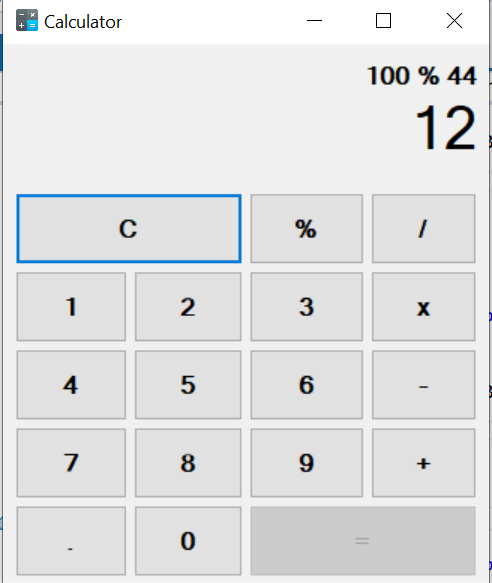

# Simple Arithmetic Calculator

A basic Windows Forms application built in C# that performs fundamental arithmetic operations such as addition, subtraction, multiplication, division, and modulus. This project is ideal for beginners learning Windows Forms and C# programming.

## Calculator UI



## Features

- **Arithmetic Operations**: Add, subtract, multiply, divide, and find the remainder of two numbers.
- **Digit Input Buttons**: Includes buttons for digits (0–9) to input numbers easily.
- **Dynamic Font Adjustment**: Automatically adjusts font size for long inputs.
- **Input Validation**: Displays an error message when input exceeds the maximum limit.
- **Clear and Reset**: Buttons to reset inputs and results for a clean workflow.

## How to Run

1. Clone the repository:
   ```bash
   git clone https://github.com/your-username/arithmetic-calculator.git
